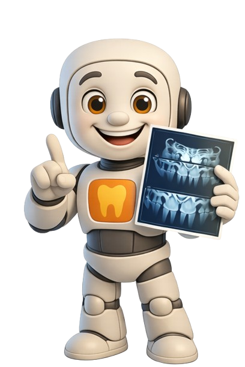
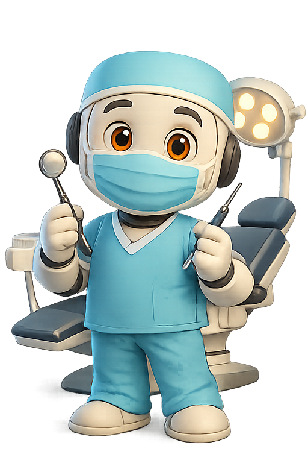
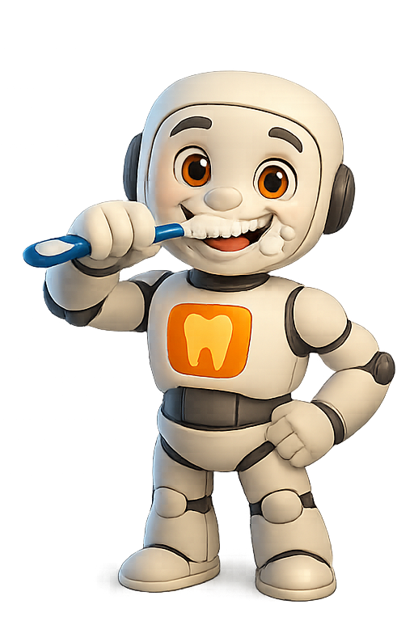
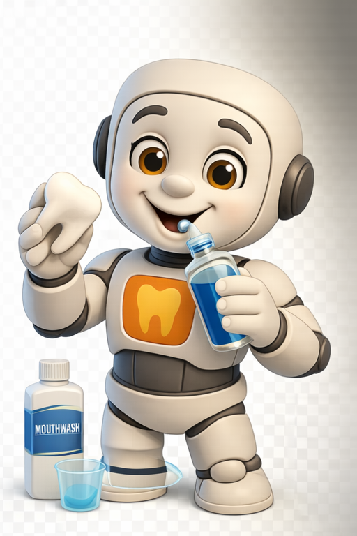
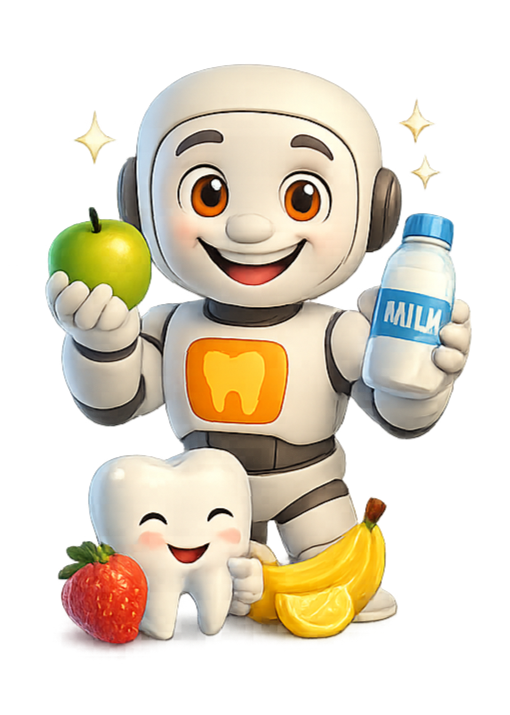

# DentWise Pitch Deck README

<p align="center">
  
</p>

<h1 align="center">DentWise</h1>
<p align="center"><b>AI Dental Care Copilot for Patients, Clinics, and Ops Teams</b></p>

<p align="center">
  
</p>

## The Problem

Dental platforms are often fragmented:
- Booking is separate from reminders
- Care plans are disconnected from visits
- Clinics lose time on repetitive follow-ups
- Patients miss appointments and post-visit routines

## The Solution

DentWise unifies the complete dental care lifecycle in one platform:
- Smart booking with doctor availability
- Automatic reminders and follow-ups
- Timeline + notifications + care plans
- Admin control center for clinic operations
- Voice AI touchpoint for interactive support

## Product Snapshot

| Homepage | Dashboard |
|---|---|
|  |  |

| Appointments | Voice AI |
|---|---|
|  |  |

| Care Plan | Admin |
|---|---|
|  |  |

## Why DentWise Wins

- End-to-end flow: discovery -> booking -> reminders -> recovery
- Built for both patient UX and clinic operations
- Uses modern production-ready stack (Next.js, Prisma, Clerk, Resend)
- Easy to scale with additional channels (SMS, analytics, automation)

## Core Value Pillars

### 1) Better Patient Outcomes
- Timely reminders reduce no-shows
- Care tasks improve post-visit adherence
- Timeline keeps patients informed

### 2) Better Clinic Efficiency
- Centralized doctor availability engine
- Admin dashboard for real-time operations
- Automated reminders reduce manual outreach

### 3) Better Engagement
- Smart notifications
- Email confirmation and action links
- Voice assistant for guided interactions

## Feature Highlights

| Booking Flow | Reminder Engine |
|---|---|
|  |  |

| Timeline | Notifications |
|---|---|
|  |  |

| Add Doctor | Availability/Recent Ops |
|---|---|
|  |  |

## Brand Visual Language

<p align="center">
  
  
  
  
  
  
</p>

## Business-Ready Foundation

- Auth and role boundaries with Clerk
- Data layer with Prisma + PostgreSQL
- Transactional email via Resend
- Cron and webhook-ready operations
- Vercel deployment model

## Ideal Use Cases

- Digital-first dental clinics
- Multi-doctor practices
- Appointment-heavy practices with no-show pain
- Care programs needing patient adherence tracking

## Quick Start

```bash
npm install
cp .env.example .env
npx prisma db push
npm run dev
```

## Project Positioning

DentWise is not just a booking tool.  
It is a care operations platform that improves both **clinical continuity** and **operational efficiency**.

